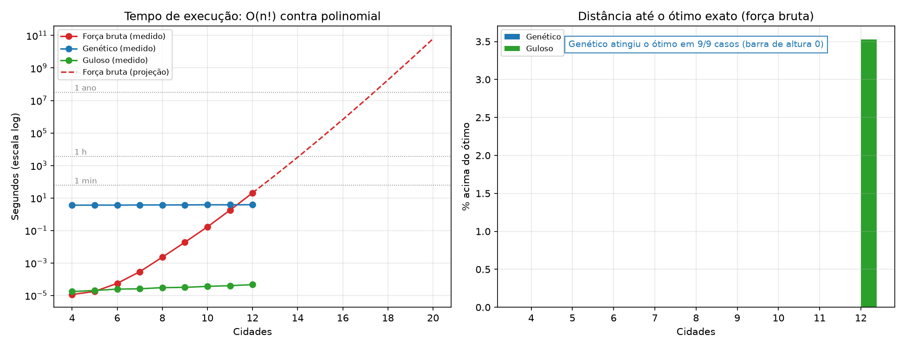
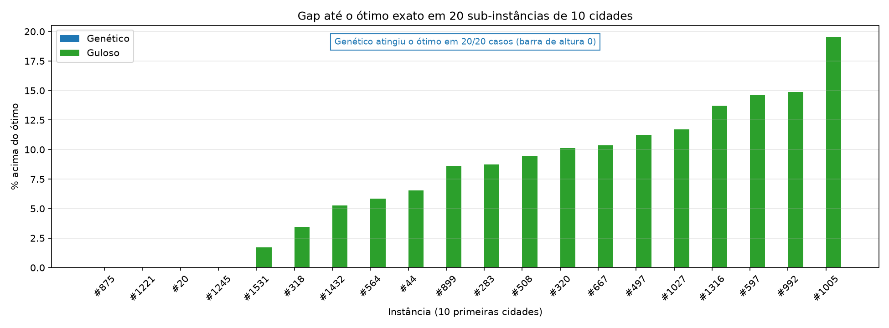
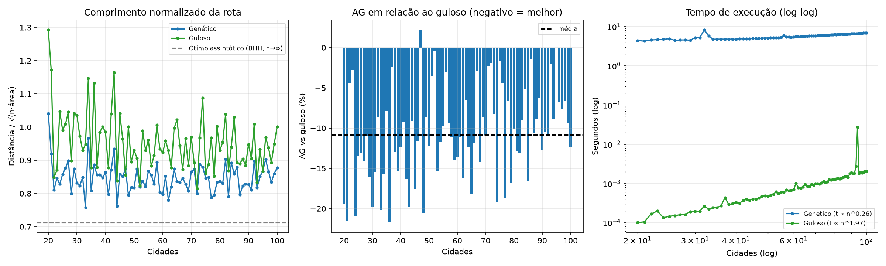
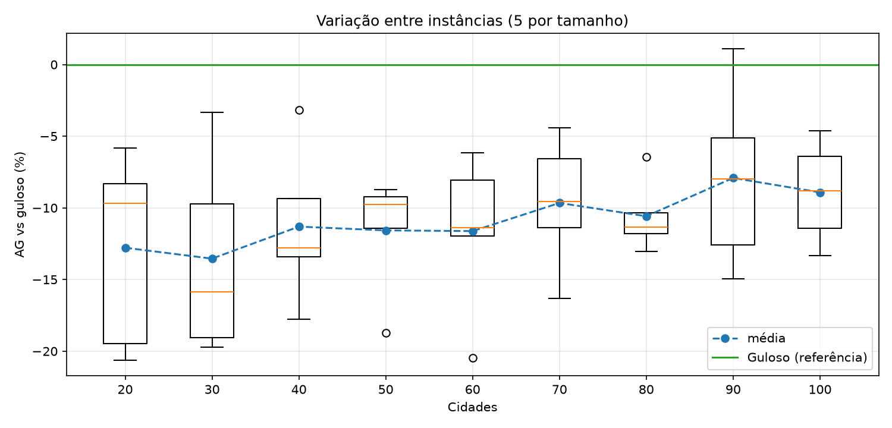
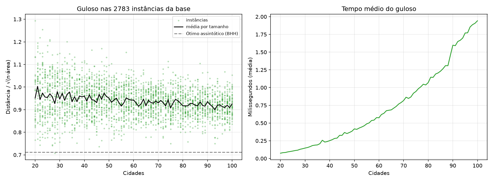
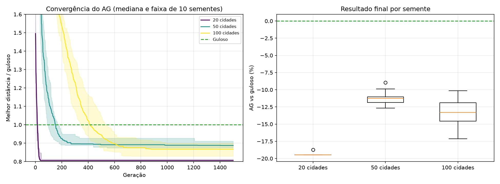
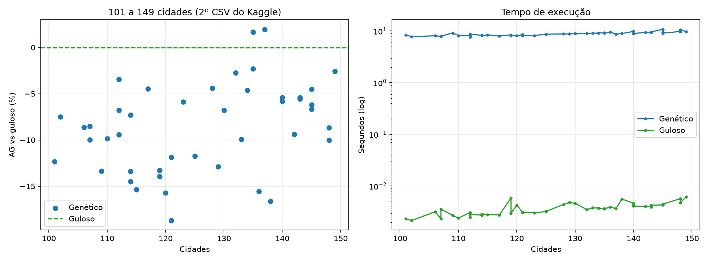
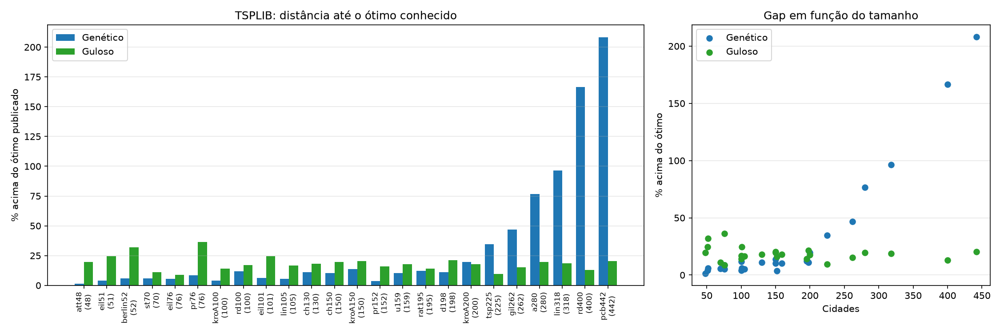

# Resultados

Gerado por `python benchmarks.py`. Cada algoritmo roda uma vez por instância, na mesma máquina; o AG usa a configuração padrão de `genetic.py` (população 200, 1.500 gerações).

## Benchmark principal

- AG vs guloso nas instâncias completas: média -13,7%.

Tabela: [tables/benchmark.md](tables/benchmark.md) · dados: [data/benchmark.csv](data/benchmark.csv)

## GIFs

- [brute_force_10.gif](gifs/brute_force_10.gif)
- [genetic_10.gif](gifs/genetic_10.gif)
- [genetic_100.gif](gifs/genetic_100.gif)
- [genetic_20.gif](gifs/genetic_20.gif)
- [genetic_50.gif](gifs/genetic_50.gif)
- [greedy_10.gif](gifs/greedy_10.gif)
- [greedy_100.gif](gifs/greedy_100.gif)
- [greedy_20.gif](gifs/greedy_20.gif)
- [greedy_50.gif](gifs/greedy_50.gif)

## E1 — Crescimento da força bruta

*Quanto custa garantir o ótimo? Força bruta de 4 a 12 cidades e projeção de O(n!).*

- Força bruta com 12 cidades: 20,57 s (970.265 rotas/s avaliadas).
- Projeção na mesma máquina: 15 cidades → 12,5 h; 20 → 1.986 anos; 25 → 1,0 × 10^10 anos (73% da idade do universo); 100 → 1,5 × 10^142 anos.

Tabela: [tables/E1.md](tables/E1.md) · dados: [data/E1.csv](data/E1.csv)

## E2 — Gap até o ótimo exato

*Em 20 instâncias de 10 cidades, quanto o AG e o guloso ficam acima do ótimo?*

- Genético: ótimo em 20/20 instâncias; gap médio 0,00%, máximo 0,00%.
- Guloso: ótimo em 4/20 instâncias; gap médio 7,79%, máximo 19,53%.

Tabela: [tables/E2.md](tables/E2.md) · dados: [data/E2.csv](data/E2.csv)

## E3 — Todos os tamanhos da base

*Como qualidade e tempo evoluem de 20 a 100 cidades (81 tamanhos)?*

- AG melhor que o guloso em 80/81 tamanhos; diferença média -10,8% (de -21,7% a +2,2%).
- Crescimento empírico do tempo nesta faixa: guloso ∝ n^1,97, AG ∝ n^0,26 (gerações e população fixas).

Tabela: [tables/E3.md](tables/E3.md) · dados: [data/E3.csv](data/E3.csv)

## E4 — Variação entre instâncias

*A vantagem do AG se mantém em instâncias diferentes do mesmo tamanho?*

- 45 instâncias: AG melhor que o guloso em 44; média -10,9% ± 5,1 (desvio).

Tabela: [tables/E4.md](tables/E4.md) · dados: [data/E4.csv](data/E4.csv)

## E5 — Guloso em toda a base

*Visão das 2.783 instâncias com o algoritmo mais barato.*

- 2783 instâncias resolvidas pelo guloso em 2,02 s no total (média 0,73 ms por instância).

Tabela: [tables/E5.md](tables/E5.md) · dados: [data/E5.csv](data/E5.csv)

## E6 — AG com 10 sementes

*O AG é estável? Como ele converge ao longo das gerações?*

- 20 cidades: AG -19,4% vs guloso em média; variação entre sementes (CV) 0,29%.
- 50 cidades: AG -11,2% vs guloso em média; variação entre sementes (CV) 1,23%.
- 100 cidades: AG -13,3% vs guloso em média; variação entre sementes (CV) 2,32%.

Tabela: [tables/E6.md](tables/E6.md) · dados: [data/E6.csv](data/E6.csv)

## E7 — 101 a 149 cidades

*O comportamento se mantém acima de 100 cidades (segundo CSV do Kaggle)?*

- 44 instâncias: AG melhor em 42; média -8,6% (de -18,7% a +2,0%).

Tabela: [tables/E7.md](tables/E7.md) · dados: [data/E7.csv](data/E7.csv)

## E8 — TSPLIB com ótimo publicado

*Em instâncias clássicas de 48 a 442 cidades, quão longe do ótimo real ficamos?*

- Guloso: gap médio 18,6% acima do ótimo; AG: 32,5%. AG melhor que o guloso em 17/24 instâncias.
- AG até 100 cidades: gap médio 5,9%; acima de 200 cidades: 104,9% (mesmas 1.500 gerações).

Tabela: [tables/E8.md](tables/E8.md) · dados: [data/E8.csv](data/E8.csv)
