# Resultados

5 execuções com 8, 12, 20, 50, 100 cidades. Em cada execução, força bruta, genético e guloso resolvem **a mesma instância** da base do Kaggle (`#id` = `instance_id`; `primeiras k` = só as k primeiras cidades da instância). Gerado por `python benchmarks.py`.

## Distância total

| Execução | Cidades | Instância | Força bruta | Genético | Guloso | Menor distância | Genético vs guloso | Genético vs ótimo | Guloso vs ótimo |
| ---: | ---: | :--- | ---: | ---: | ---: | :--- | ---: | ---: | ---: |
| 1 | 8 | #20 (primeiras 8) | 328,28 | 328,28 | 328,28 | Força bruta = Genético = Guloso | +0,0% | +0,0% | +0,0% |
| 2 | 12 | #20 (primeiras 12) | 348,79 | 348,79 | 361,10 | Força bruta = Genético | -3,4% | +0,0% | +3,5% |
| 3 | 20 | #20 | não executada ¹ | 465,69 | 578,31 | Genético | -19,5% | — | — |
| 4 | 50 | #132 | não executada ¹ | 577,79 | 658,27 | Genético | -12,2% | — | — |
| 5 | 100 | #56 | não executada ¹ | 877,25 | 1.000,77 | Genético | -12,3% | — | — |

Distância do circuito completo, com retorno à cidade inicial. **Genético vs guloso**: diferença da distância do genético em relação à do guloso (negativo = rota menor). **vs ótimo**: diferença em relação à rota ótima exata da força bruta, disponível somente quando ela é executada.

## Tempo de execução

| Execução | Cidades | Força bruta | Genético | Guloso | Mais rápido | Genético ÷ guloso | Força bruta ÷ guloso |
| ---: | ---: | ---: | ---: | ---: | :--- | ---: | ---: |
| 1 | 8 | 2,36 ms | 3,75 s | 49 µs | Guloso | 76.090× | 47,8× |
| 2 | 12 | 21,77 s | 4,31 s | 66 µs | Guloso | 64.852× | 327.346× |
| 3 | 20 | não executada ¹ | 4,32 s | 126 µs | Guloso | 34.194× | — |
| 4 | 50 | não executada ¹ | 5,33 s | 466 µs | Guloso | 11.438× | — |
| 5 | 100 | não executada ¹ | 7,48 s | 2,17 ms | Guloso | 3.450× | — |

**Genético ÷ guloso** e **Força bruta ÷ guloso**: quantas vezes a abordagem foi mais lenta que o guloso.

¹ A força bruta avalia `(n-1)!/2` rotas. A partir de 16 cidades ela não é executada e é registrada como `timeout`; até 15 cidades, roda com prazo de 600 s.

## Gráfico

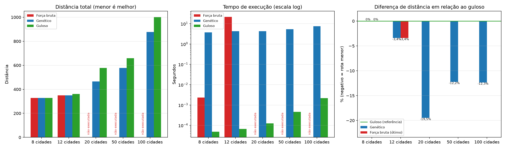

## GIFs

| Execução | Força bruta | Genético | Guloso |
| :--- | :---: | :---: | :---: |
| 1 (8 cidades) | 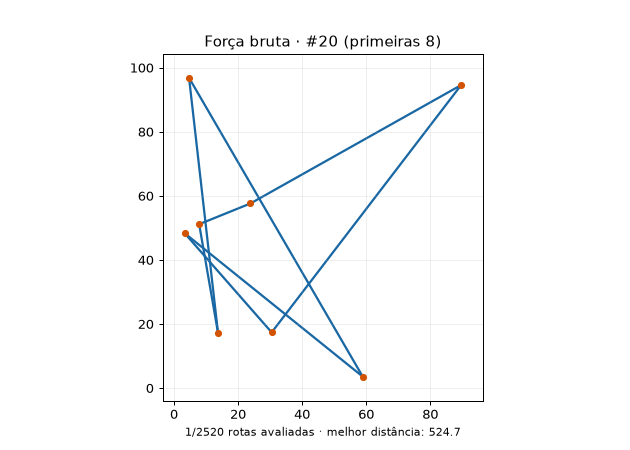 | 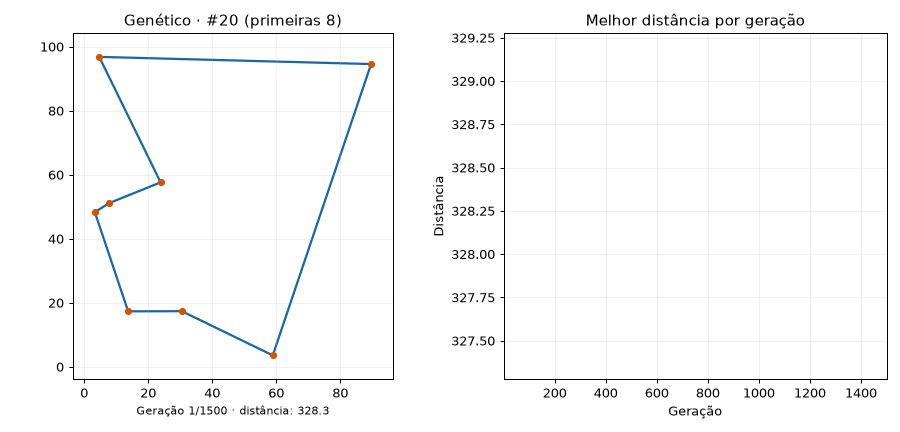 | 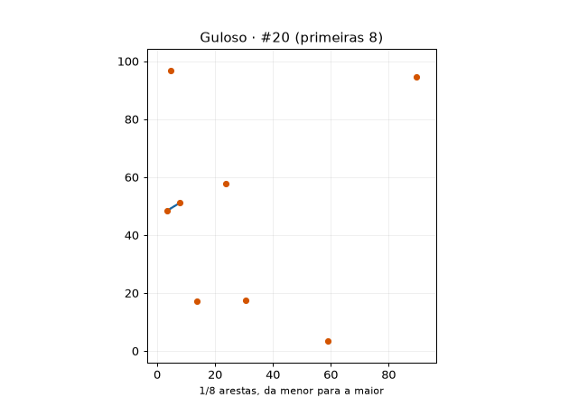 |
| 2 (12 cidades) | 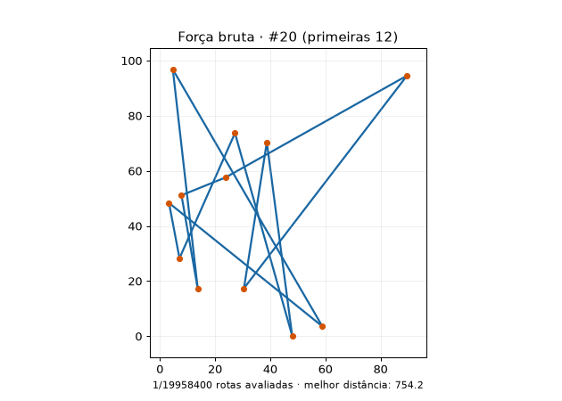 | 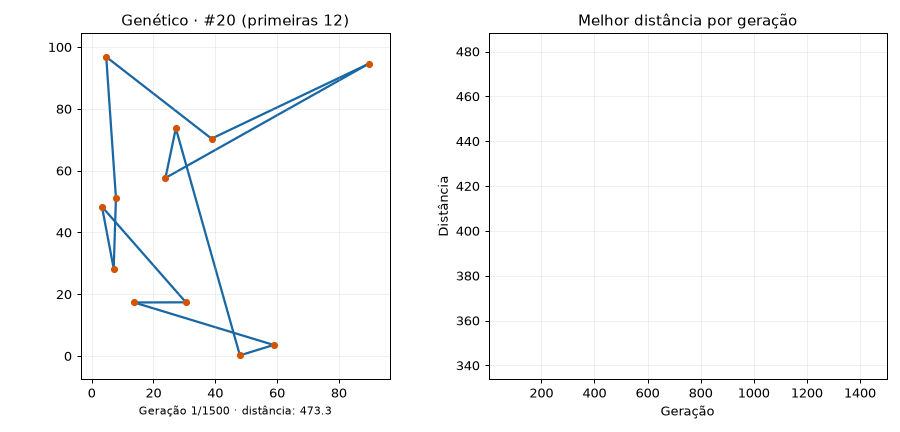 | 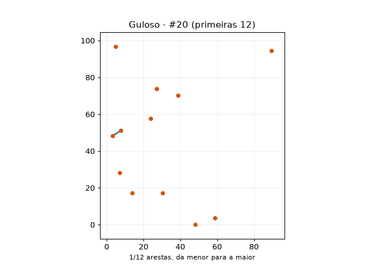 |
| 3 (20 cidades) | — | 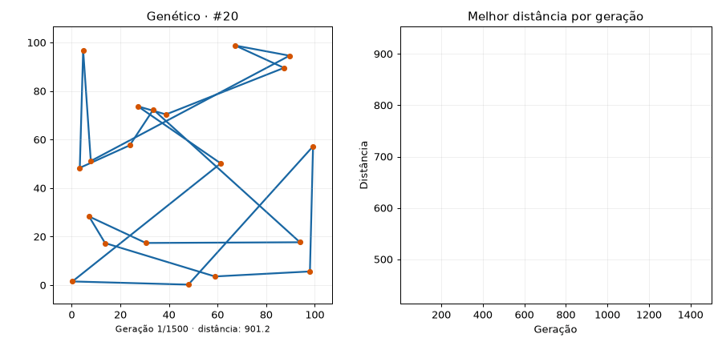 | 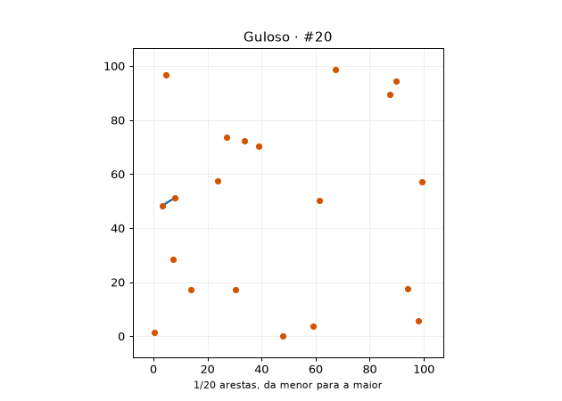 |
| 4 (50 cidades) | — | 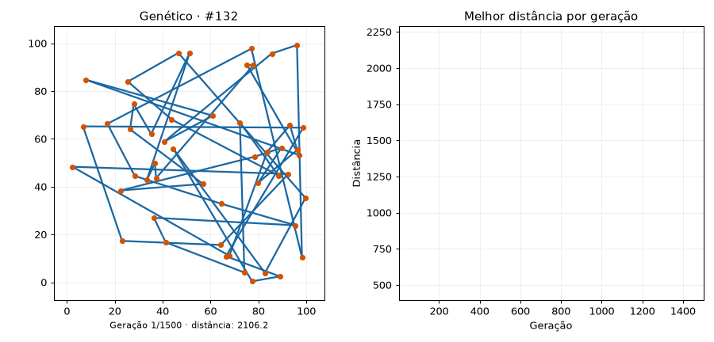 | 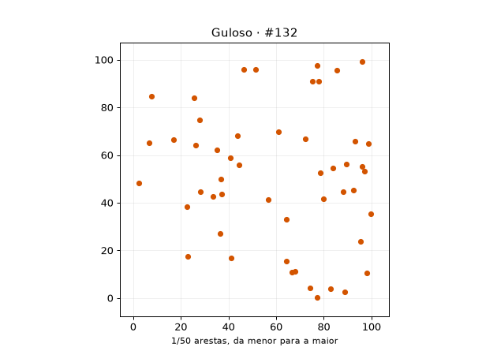 |
| 5 (100 cidades) | — | 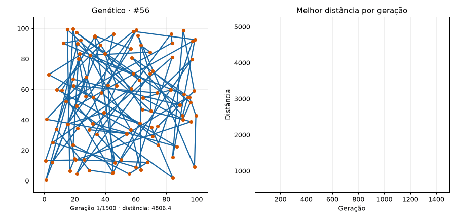 | 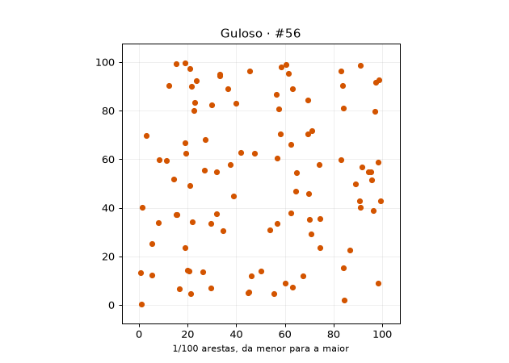 |

## Arquivos

- Dados brutos: [data/results.csv](data/results.csv)
- Tabela por abordagem: [tables/results.md](tables/results.md)
- Gráfico: [graphs/comparison.png](graphs/comparison.png)
